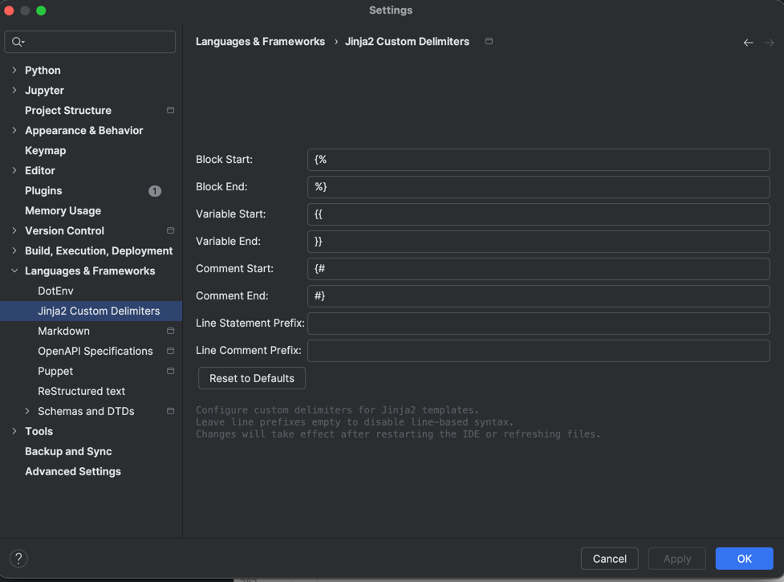

# Jinja2 Custom Delimiters

<!-- Plugin description -->
**A PyCharm Professional plugin** that allows you to configure custom Jinja2 template delimiters while maintaining full IDE language support including syntax highlighting, code completion, and formatting.

> **⚠️ Requires PyCharm Professional**
> This plugin leverages PyCharm Professional's built-in Jinja2 formatter for perfect code formatting with custom delimiters.
<!-- Plugin description end -->

## Why This Plugin?

Jinja2's default delimiters (`{{`, `{%`, `{#`) can conflict with other template engines or frontend frameworks. This plugin lets you use custom delimiters (like `[%`, `[[`, `[#`) while preserving all of PyCharm Professional's powerful Jinja2 features.

## Features

### 🎨 **Custom Delimiter Configuration**
- **Variable delimiters**: `{{ variable }}` → `[[ variable ]]`
- **Block delimiters**: `` → `[% for %]`
- **Comment delimiters**: `{# comment #}` → `[# comment #]`
- **Whitespace control**: `` work with custom delimiters too

### 🧠 **IDE Language Support**
- **Code formatting** - Perfect indentation and spacing using PyCharm Professional's formatter
- **Code completion** for Jinja2 keywords, filters, and functions (via built-in Jinja2 support)
- **Error detection** and syntax validation (via built-in Jinja2 support)

### ⚠️ **Known Limitations**
- **Syntax highlighting**: Files with custom delimiters won't have full syntax highlighting until formatted, as PyCharm's lexer expects standard Jinja2 delimiters. This is a trade-off for reliable code formatting.
- **Recommended workflow**: Use standard Jinja2 extensions (`.j2`, `.jinja2`) and configure files to be recognized as "Jinja 2 Template" file type for best results.
- **Line prefixes**: Line statement/comment prefixes are stored in settings but are not applied during formatting.

## Installation

### Requirements
- **PyCharm Professional 2025.2+**

### From JetBrains Marketplace (Recommended)
1. Open PyCharm Professional
2. Go to <kbd>File</kbd> → <kbd>Settings</kbd> → <kbd>Plugins</kbd>
3. Click <kbd>Marketplace</kbd> tab
4. Search for "Jinja2 Custom Delimiters"
5. Click <kbd>Install</kbd>

### Manual Installation
1. Download the latest plugin ZIP from [Releases](https://github.com/lesleslie/jinja2-custom-delimiters/releases)
2. In PyCharm: <kbd>File</kbd> → <kbd>Settings</kbd> → <kbd>Plugins</kbd> → <kbd>⚙️</kbd> → <kbd>Install Plugin from Disk...</kbd>
3. Select the downloaded ZIP file

## Quick Start

### 1. Configure Delimiters
After installation, configure your custom delimiters:

1. Go to <kbd>File</kbd> → <kbd>Settings</kbd> → <kbd>Languages & Frameworks</kbd> → <kbd>Jinja2 Custom Delimiters</kbd>
2. Set your preferred delimiters:
   ```
   Variable Start: [[        Variable End: ]]
   Block Start:    [%        Block End:    %]
   Comment Start:  [#        Comment End:  #]
   ```
3. Click <kbd>Apply</kbd>



### 2. Configure File Type Recognition
For the plugin to format files with custom delimiters, they must be recognized as **Jinja2** language:

**Option A - Automatic Recognition (Recommended)**
Use these extensions:
- `.jinja2` → Automatic
- `.jinja` → Automatic
- `.j2` → Automatic

**Option B - Manual Configuration**
For `.html` or other extensions:
1. <kbd>Settings</kbd> → <kbd>Editor</kbd> → <kbd>File Types</kbd>
2. Find "Jinja 2 Template"
3. Click <kbd>+</kbd> under "File name patterns"
4. Add `*.html` (or specific patterns like `template_*.html`)

### 3. Create Template Files
Create files with your custom delimiters:

```html
<!-- Use your custom delimiters -->
[[ user.name ]]
[% for item in items %]
  [# This is a comment #]
[% endfor %]
```

### 4. Format Your Code
Press <kbd>Cmd+Alt+L</kbd> (Mac) or <kbd>Ctrl+Alt+L</kbd> (Windows/Linux) to automatically format your Jinja2 templates with perfect indentation and spacing!

**Example:**
```html
<!-- Before formatting -->
[%for item in items%]
<li>[[item.name]]</li>
[%endfor%]

<!-- After formatting (Cmd+Alt+L) -->
[% for item in items %]
    <li>[[ item.name ]]</li>
[% endfor %]
```

## How It Works

The plugin uses a clever approach:
1. **Pre-Format**: Converts your custom delimiters to standard Jinja2 (`[%` → `{%`)
2. **Format**: Uses PyCharm Professional's battle-tested Jinja2 formatter
3. **Post-Format**: Converts back to your custom delimiters (`{%` → `[%`)

**Result**: Perfect formatting with your custom delimiters! ✨

## Use Cases

### 🔧 **Avoiding Conflicts**
When using Jinja2 with:
- **Vue.js/Angular**: Use `[[ ]]` instead of `{{ }}` to avoid frontend framework conflicts
- **Liquid templates**: Use different delimiters to distinguish template engines
- **Custom build systems**: Match your organization's template conventions

### 🎯 **Framework Integration**
Perfect for:
- **Django projects** with custom template configurations
- **Flask applications** with non-standard Jinja2 setups
- **Static site generators** with custom delimiter requirements
- **FastBlocks** which uses custom delimiters by default
- **Multi-template environments** where different delimiters clarify intent

## Troubleshooting

### Formatting Does Nothing
**Check these:**
1. Is file recognized as "Jinja2" language? (Check bottom-right corner of editor)
2. Are custom delimiters configured in settings?
3. Are you using PyCharm Professional? (Community editions don't have the Jinja2 formatter)

### No Syntax Highlighting
**Expected behavior** with this simplified plugin. Files with custom delimiters won't have full syntax highlighting until you format them at least once. This is a trade-off for reliable formatting.

**Workarounds:**
- Format the file once (<kbd>Cmd/Ctrl+Alt+L</kbd>) to help PyCharm understand the structure
- Use standard `.j2` or `.jinja2` extensions for better automatic recognition

## Development

### Building from Source
```bash
git clone https://github.com/lesleslie/jinja2-custom-delimiters.git
cd jinja2-custom-delimiters
./gradlew build
```

### Running Tests
```bash
./gradlew test
```

### Development IDE Setup
```bash
./gradlew runIde
```

## Technical Details

The plugin uses a simplified architecture:
- **IntelliJ Platform SDK** for IDE integration
- **Pre/Post format processors** for delimiter conversion before/after formatting
- **Persistent settings** with thread-safe access
- Works directly with PyCharm's built-in Jinja2 language support
- Only 4 Java source files - minimal complexity and maintenance

**Architecture:**
1. User edits file with custom delimiters (e.g., `[%` and `[[`)
2. File must be recognized as "Jinja 2 Template" language
3. When formatting (<kbd>Cmd/Ctrl+Alt+L</kbd>):
   - **PreFormatProcessor** converts `[%` → `{%` in memory
   - **PyCharm's Jinja2 formatter** formats the code
   - **PostFormatProcessor** converts `{%` → `[%` back
4. Result: Perfect formatting with custom delimiters preserved!

## Support

- **Issues**: [GitHub Issues](https://github.com/lesleslie/jinja2-custom-delimiters/issues)
- **Feature Requests**: [GitHub Discussions](https://github.com/lesleslie/jinja2-custom-delimiters/discussions)
- **Email**: les@wedgwoodwebworks.com

## Contributing

1. Fork the repository
2. Create a feature branch (`git checkout -b feature/amazing-feature`)
3. Make your changes
4. Add tests for new functionality
5. Commit your changes (`git commit -m 'Add amazing feature'`)
6. Push to the branch (`git push origin feature/amazing-feature`)
7. Open a Pull Request

## License

This project is licensed under the MIT License - see the [LICENSE](LICENSE) file for details.

---

**Developed by** [Wedgwood Web Works](https://wedgwoodwebworks.com)

Built with the [IntelliJ Platform Plugin Template](https://github.com/JetBrains/intellij-platform-plugin-template)
